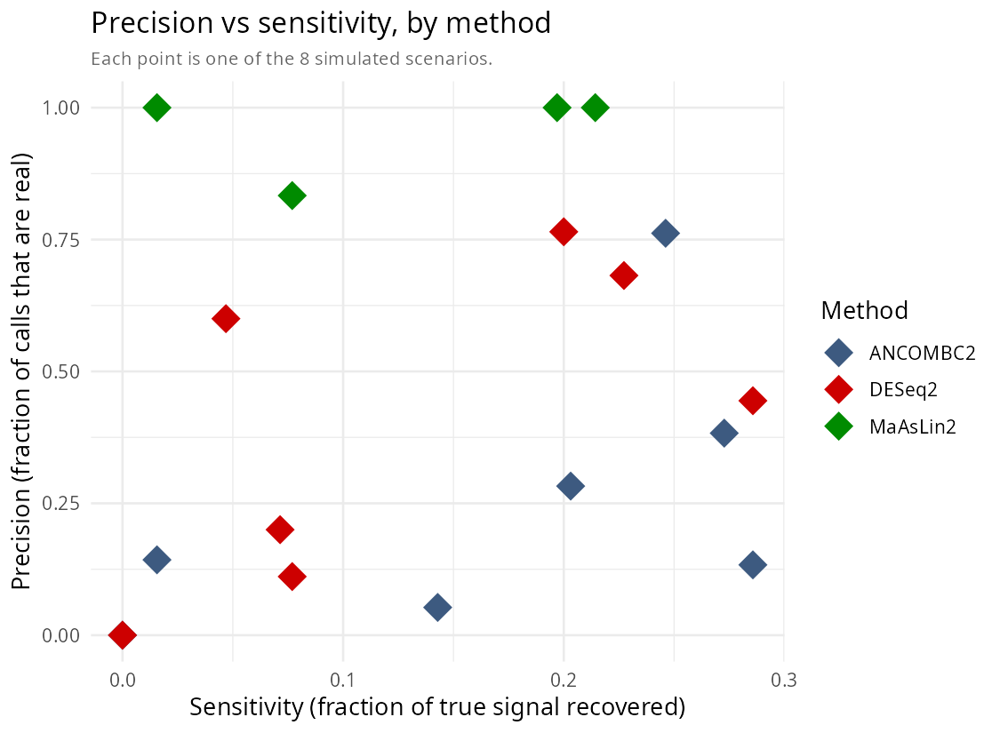
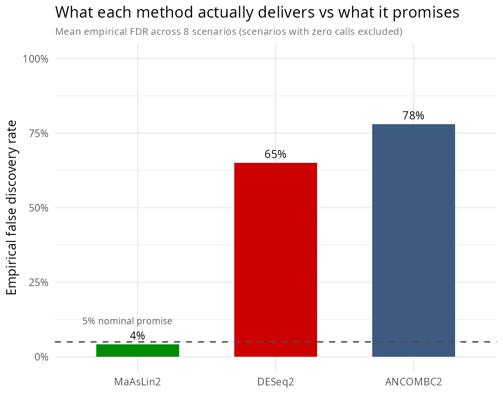
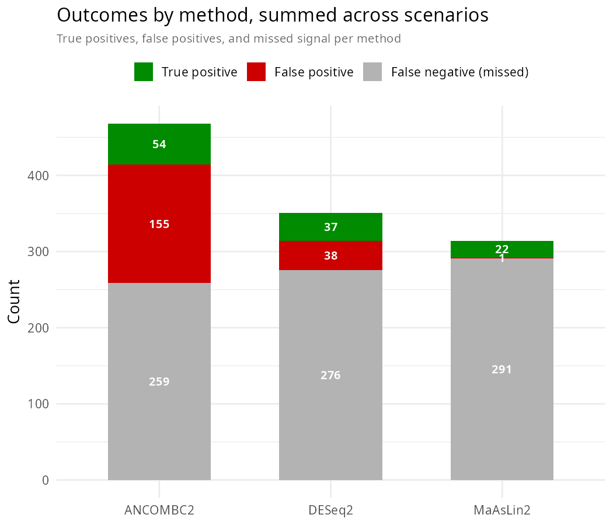

# Microbiome Differential Abundance Benchmark

Which microbiome differential abundance method should you trust? Three popular tools,
three different ways of approaching the same problem, tested on simulated data where
the right answer is already known.

>*Learning project. Simulated data.

---

## The problem

Different microbiome differential abundance methods often give different answers about
which taxa are linked to a phenotype. A study across 38 real datasets found that 14
commonly used methods frequently disagreed with each other (Nearing et al. 2022,
*Nature Communications*).

The trouble is, on real data you don't know which method is right. There's no answer
key to check against — just disagreement, with no way to say who's wrong.

Simulation fixes that. Build the data yourself, decide in advance which taxa are truly
different between groups, and then see which method actually finds them.

---

## Three methods, three approaches

| Tool | Normalisation | Transform | Distribution / Model | Compositionally aware |
|---|---|---|---|---|
| DESeq2 | RLE | None | Negative binomial | No |
| MaAsLin2 | TSS | AST (log by default in newer versions) | Linear model | No |
| ANCOM-BC2 | Bias correction | Internal log transformation | Bias-corrected linear model | **Yes** |

**DESeq2** models the counts directly and ignores compositionality entirely — the
baseline here.

**MaAsLin2** normalises to proportions, log-transforms, and fits a linear model. A
standard approach, but doesn't correct for compositionality directly.

**ANCOM-BC2** fits a similar linear model but first estimates and removes a
sample-specific bias term caused by compositionality.

---

## How the data was built

Real microbiome data is sparse, noisy, and correlated across taxa in ways that are hard
to fake convincingly. Instead of generating counts from a plain textbook distribution,
this uses **SparseDOSSA2**, fit to a public reference (the Human Microbiome Project),
so the simulated noise and sparsity stay close to what real data looks like.

On top of that background, a known signal is planted: a chosen set of taxa are made
genuinely different between two groups, and everything else is left as pure noise. That
planted signal is the answer key every method gets checked against.

Eight scenarios in total — small (n=30) and large (n=100) sample size, weak and strong
effect size, few (2%) and many (10%) taxa carrying real signal — each one simulated
separately and run through all three methods.

**One bug worth mentioning, because it changed the result.** SparseDOSSA2's spike-in
uses its own continuous covariate, not a simple label — an early version of this pipeline
built a fake group label instead of using it, and every method scored as finding almost
nothing. Once fixed, results changed completely. A second bug: MaAsLin2 quietly rewrites
taxon names (`|` becomes `.`) in its output, so a raw string comparison against the
ground truth called every one of its correct hits a miss. Both are fixed in the current
code; worth knowing because either one alone would have produced a plausible but wrong
conclusion.

---

## What the benchmark measured

For each method, on each scenario, checked against the planted signal:

- **Sensitivity** — how many of the true differences it actually found
- **Precision** — of what it reported, how much was real
- **Empirical FDR** — how often a reported hit was wrong, checked against the 5% the
  method promises to control
- **Runtime**

---

## Results

Mean of the scenario-level metrics across all 8 scenarios:

| Method | Sensitivity | Precision | Empirical FDR | Runtime |
|---|---:|---:|---:|---:|
| DESeq2 | 0.114 | 0.350 | 0.650 | 3.0s |
| ANCOM-BC2 | 0.146 | 0.220 | 0.780 | 21.2s |
| MaAsLin2 | 0.126 | **0.958** | **0.042** | **0.4s** |

Using a 5% significance/FDR threshold, only MaAsLin2 stayed close to the nominal 5%
empirical FDR across these simulations.

DESeq2 and ANCOM-BC2 recovered more true positives, but also produced substantially
more false discoveries in these simulations — DESeq2's calls were wrong about 65% of
the time on average across scenarios, ANCOM-BC2's about 78%, despite both being run at
the same 5% threshold. That's the same failure Hawinkel et al. (2019, *Briefings in
Bioinformatics*) found when they ran a similar test, showing up again here on a fresh
simulation.

MaAsLin2 goes the other way. When it calls a taxon significant, it's almost always
right — but it also misses more, calling zero significant hits in half the scenarios,
mostly the smaller and harder ones. Its restraint isn't free; it's just restraint in
the direction that keeps the 5% promise honest.

Sensitivity looks similar across all three methods, which makes the differences in
precision and FDR the real story — not "which method finds the most," but "which
method can be trusted when it reports something."

MaAsLin2 was also the fastest by a wide margin — under half a second per scenario
against 21 seconds for ANCOM-BC2.







---

## Notes

- **Most of the other methods from that 14-method comparison.** Installing, debugging,
  and keeping fourteen tools consistent is a lot of overhead for one person. Three is
  enough to show that the choice of method genuinely changes the answer. ALDEx2,
  Corncob, and metagenomeSeq would be reasonable next additions.
- **Real data.** A method that wins here can still fall short on an actual dataset,
  because no simulation captures every quirk of real biology. This is a test on
  simulated data, not a final verdict — checking the conclusions against a real
  dataset would be the natural next step.
- **Covariates and random effects.** All three tools support them, but this benchmark
  sticks to the simplest two-group comparison, so the result reflects each method's
  core assumptions rather than how well it handles extra complexity.

---

## How to run it

```r
BiocManager::install(c("SparseDOSSA2", "DESeq2", "ANCOMBC", "Maaslin2"))
```

Run the scripts in `code/` in order from the repo root. The first one fits the
simulation template and caches it; everything after that reads and writes to `data/`
and `results/` relative to the repo root.

---

## References

- Nearing JT et al. (2022). Microbiome differential abundance methods produce different
  results across 38 datasets. *Nature Communications* 13:342.
- Hawinkel S et al. (2019). A broken promise: microbiome differential abundance methods
  do not control the false discovery rate. *Briefings in Bioinformatics* 20:210–221.
- Ma S, Ren B, Mallick H, Moon YS, Schwager E, Maharjan S, Tickle TL, Lu Y, Carmody RN,
  Franzosa EA, Janson L & Huttenhower C (2021). A statistical model for describing and
  simulating microbial community profiles. *PLoS Computational Biology* 17:e1008913.
- Love MI, Huber W & Anders S (2014). Moderated estimation of fold change and dispersion
  for RNA-seq data with DESeq2. *Genome Biology* 15:550.
- Mallick H et al. (2021). Multivariable association discovery in population-scale
  meta-omics studies. *PLoS Computational Biology* 17:e1009442.
- Lin H & Peddada SD (2020). Analysis of compositions of microbiomes with bias
  correction. *Nature Communications* 11:3514.

## License

MIT
